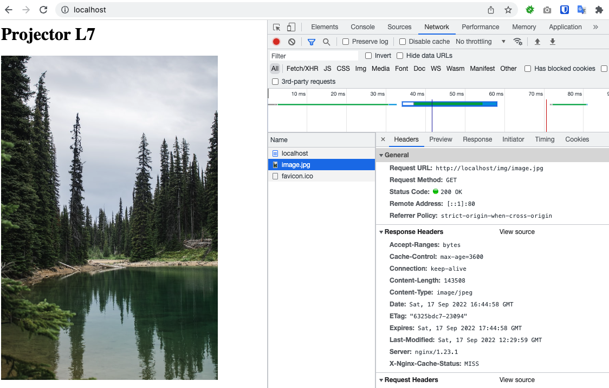
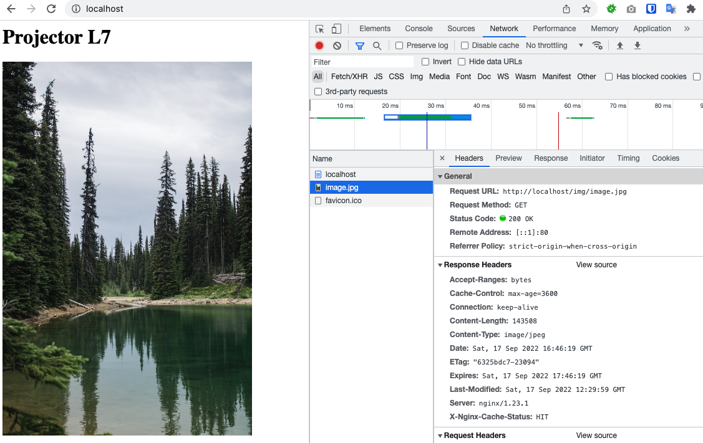
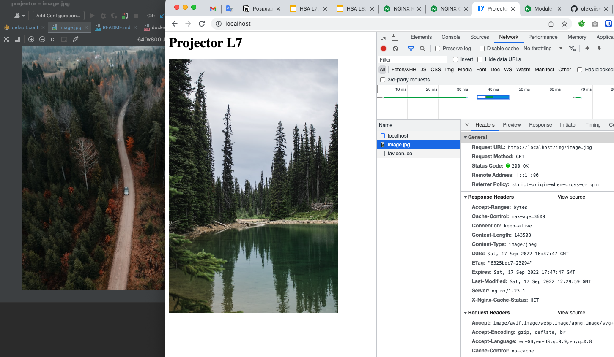
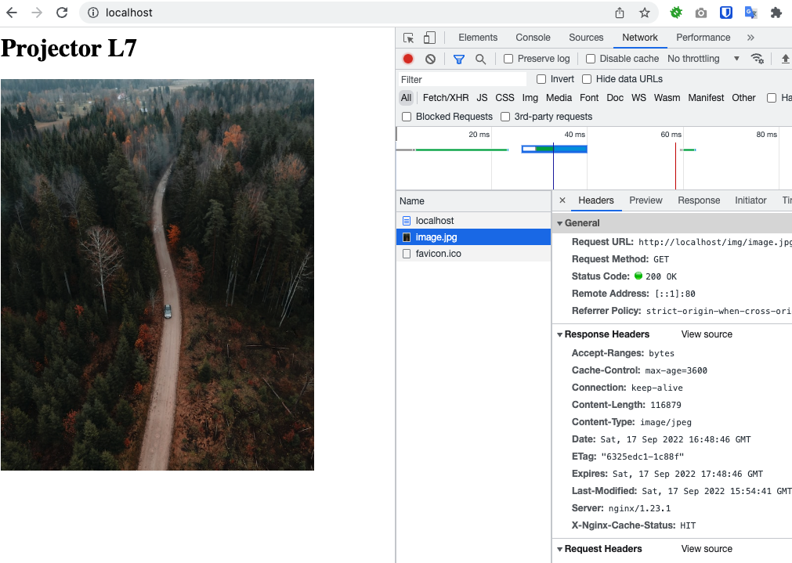

# Projector L7 Web Server

Use **docker-compose** command to launch an nginx container. 

To view the application use http://localhost url. 

Images are located in www/img directory. 

**X-Cache-Status** is added to see cache status. 

### Purge

As I don't have a commercial nginx license **proxy_purge_cache** directive doesn't work, receiving an error: _nginx: [emerg] unknown directive "proxy_cache_purge" in /etc/nginx/conf.d/default.conf_

I used a **proxy_cache_bypass** directive for that. Use **curl http://localhost/img/image.jpg -s -I -H "secret-header:true"** request to bypass cache and “refresh” it. 

### Results

First two requests will show X-Cache-Status:MISS header as proxy_cache_min_uses 2; direcive is set. 

Third request will return X-Cache-Status:HIT header

Replace image and you'll still see an old one taken from the cache. 

Run **curl http://localhost/img/image.jpg -s -I -H "secret-header:true"** request and you'll see an updated image

